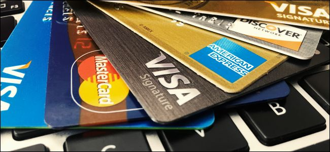

# Customer segmentation

#### -- Project Status: [Completed]

## Project Intro/Objective
The purpose of this project was to practise the knowlendge we learned in the Machine Learning weeks at Data Science Bootcamp. We selected an Unsupervised Learning task of segmentation of credit card customers.

### Methods Used
* Descriptive Statistics
* Unsupervised Machine Learning - k-Nearest Neighbours
* Data Visualization
* Dimensionality Reduction - TSNE

### Technologies
* Python
* Pandas, jupyter

## Project Description
We were given a dataset of credit card transactions. The dataset contained 8500 customers and their activity over a 6-month period. Each transaction was characterized by 18 features.

Our task was to find the most useful customer segmentation to improve the marketing campaigns of the company.

## Getting Started

To replicate results of our analysis, just download data and the Complete Analysis notebook. Afterwards just run the notebook and you can explore the results presented in the Final Presentation more deeply.

## Featured Notebooks/Analysis/Deliverables
* [Complete Analysis](link)
* [Final Presentation](reports/Credit_card_customer_analysis_final.pdf)

## Contributing Members
 - [Alzbeta Bohinikova](https://github.com/Betka112)
 - [Michael Flury](https://github.com/mikjf)
 - [Eva Polakova](https://github.com/poleva)
 - [Stefan Schultze](https://github.com/SchultzeStefan)
